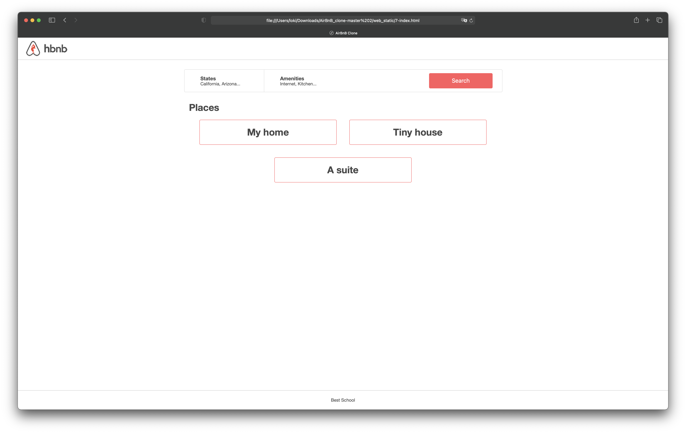

# web_static


# What Are HTML & CSS?
HTML, HyperText Markup Language, gives content structure and meaning by defining that content as, for example, headings, paragraphs, or images. CSS, or Cascading Style Sheets, is a presentation language created to style the appearance of content—using, for example, fonts or colors.

The two languages—HTML and CSS—are independent of one another and should remain that way. CSS should not be written inside of an HTML document and vice versa. As a rule, HTML will always represent content, and CSS will always represent the appearance of that content.

With this understanding of the difference between HTML and CSS, let’s dive into HTML in more detail.


# Introduction to HTML

At its heart, HTML is a language made up of elements, which can be applied to pieces of text to give them different meaning in a document (Is it a paragraph? Is it a bulleted list? Is it part of a table?), structure a document into logical sections (Does it have a header? Three columns of content? A navigation menu?), and embed content such as images and videos into a page. This module will introduce the first two of these and introduce fundamental concepts and syntax you need to know to understand HTML.

Inline Styles in HTML
Did you know you can add CSS to HTML without using a separate file? In many cases, it comes in handy. Learn when (and when not) to use CSS inline styling.
Share
Inline Styling in HTML
 # Introduction

Usually, CSS is written in a separate CSS file (with file extension .css) or in a <style> tag inside of the <head> tag, but there is a third place which is also valid. The third place you can write CSS is inside of an HTML tag, using the style attribute. When CSS is written using the style attribute, it’s called an “inline style”. In general, this is not considered a best practice. However, there are times when inline styles are the right (or only) choice.

Inline Style Syntax
Inline styles look and operate much like CSS, with a few differences. Inline styles directly affect the tag they are written in, without the use of selectors. Here’s a basic HTML page using inline styles:
``````
<!DOCTYPE html>
<html>
  <head>
    <title>Playing with Inline Styles</title>
  </head>
  <body>
    <p style="color:blue;font-size:46px;">
      I'm a big, blue, <strong>strong</strong> paragraph
    </p>
  </body>
</html>

The p tag with the inline style attribute is the focus here:

<p style="color: blue; font-size: 46px;">
``````
The style attribute is just like any other HTML attribute. It goes inside the element’s beginning tag, right after the tag name. The attribute starts with style, followed by an equals sign, =, and then finally uses double quotes, "", which contain the value of the attribute.

In our case, the value of the style attribute will be CSS property-value pairs: "property: value;". You can have as many property value pairs as you want. Unlike normal CSS syntax, inline styling does not use selectors or curly braces. Don’t forget to include the semicolon ; after each pair!

Inline styles are not so different from the other ways you can write CSS. For example, the inline style above is almost like the following CSS rule:
``````
p {
  color: blue;
  font-size: 46px;
}
``````
The rule above works the same way as our inline style does, except for one thing. This rule will affect every p on the page, whereas the inline style will affect only the <p> it’s written in.

Cascading works the same way, however, so the <strong> element inside the <p> will be blue with big text regardless of whether you decide to use inline styling or CSS rules.

When to Use Inline CSS in HTML
Professional web developers do not use inline styles often, but there are times when they are important to understand or necessary to use. Here are a few places you may see inline styles:

HTML e-mail
Older websites
CMS content (e.g. WordPress, Drupal)
Dynamic content (i.e. HTML created or changed by JavaScript)
Emails often include HTML content. When you receive a fancy looking e-mail, it is either one big image file or it is an HTML e-mail. You can craft HTML e-mails yourself, but they can be tricky. The HTML viewers in email clients are not standardized, and most of them do not allow <style> tags. For this reason, HTML e-mail often contain lots of inline styles. Some of the styles included may be archaic, to support older e-mail-viewing clients.

Another time you will see inline styles is on dynamic websites that use JavaScript. Often, JavaScript scripts will add inline styles to HTML. For example, a common way to hide a dialog box is to add the inline style display: none;.

When Not to Use Inline CSS in HTML
As mentioned before, web developers do not often use inline styles when creating web pages, for many reasons. The reasons include “semantic markup”, maintainability, reusability, and scalability.

Semantic Markup
HTML is meant for conveying structured information. CSS is built to style that structured information. When inline styles are used, this clear separation between structured information and styling is blurred. By separating the CSS from the HTML, the markup can be semantic, which means that it can convey as much meaning as possible without being muddled by visual effects.

For example, the article you are currently reading is written in HTML, separated into headings <h1> and paragraphs <p>(and the text inside those tags). This article also has specific font sizes, line spacing, and colors, but those aspects affect only the visual presentation. By keeping the markup as semantic as possible, the article’s content can be quickly edited without being distracted by aesthetics.

Additionally, it is possible to misuse HTML elements by overriding their CSS. There are many programs that interpret HTML without “looking” at it through a human eye, like screen readers and search engines. For example, the <blockquote> tag is intended to contain a block quote, but through CSS, it’s possible to make <blockquote> tags visually appear as headings. A person looking at your website through a browser would only see headings. A screen reader for sight impaired individuals, on the other hand, may read your headings as if they were quotations, which could be very confusing for sight impaired people! This problem can be created with any CSS, not just inline styles, but it is worth mentioning here. Always look for the right tag for the job before using CSS.

Maintainability, Reusability and Scalability
Because inline styles only affect the tag they are written in, it can be hard to make changes. If you have written the same style 20 times in 20 different <div> tags, you must edit each of those places whenever you want to make a trivial change. This can be exhausting! By using a single CSS rule in a <style> tag or a separate CSS file, you would only need to change it in one place.

You gain the most flexibility and power by putting your CSS in a separate CSS file. If you <link> to that CSS file on more than one HTML page, you can reuse the same stylesheet for multiple pages. If you want a consistent style across your whole website, this is the way to go. When you want to make a change, you will only need to make the change in one file, and it will be seen in each linked page.

Other types of CSS
As we mentioned, there are two other styles of implementing CSS: internal and external. Internal CSS (or embedded CSS) is added to the <head> section of an HTML document. It’s useful if you’re only stylizing a single page, and it helps keep everything in a single file, but it can also affect loading speeds. External CSS is written in its own separate file, and it’s more popular because it can style multiple pages.

Conclusion
Sometimes, inline styles are necessary. If you are building a web page by hand, however, you should avoid them whenever possible. Using a separate CSS file is the most powerful and flexible method.

